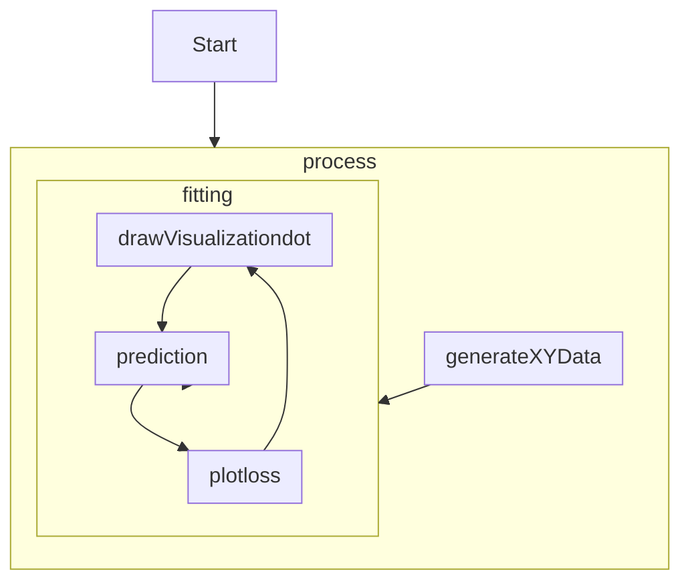

# ex11_1

## Structure

```
function drawVisualizationdot
function plotloss
function plotData2
function generateXYData
function fitting
function prediction
function process
```

## Flow



## Detail

1. process()
    1. generate initial linear regression coefficient.
    2. call generateXYData() to retreive training data sets.
    3. feed training datasets to fitting()
2. generateXYData()
    1. generate x data in the range between 0 and 1.
    2. generate y data based on corresponding x value and a random component.
    3. return two datasets: x, y.
3. fitting()
    1. set the method to construct neural network as sequential instead of functional. [src](https://stackoverflow.com/questions/57751417/what-is-meant-by-sequential-model-in-keras)
    2. add a dense layer
        1. tf.layers.dense.units: neuron count
        2. tf.layers.dense.inputShape: input node count
    3. set training optimizer as tf.SGDOptimizer which utilizes stochastic gradient descent(extreme large dataset).
    4.
