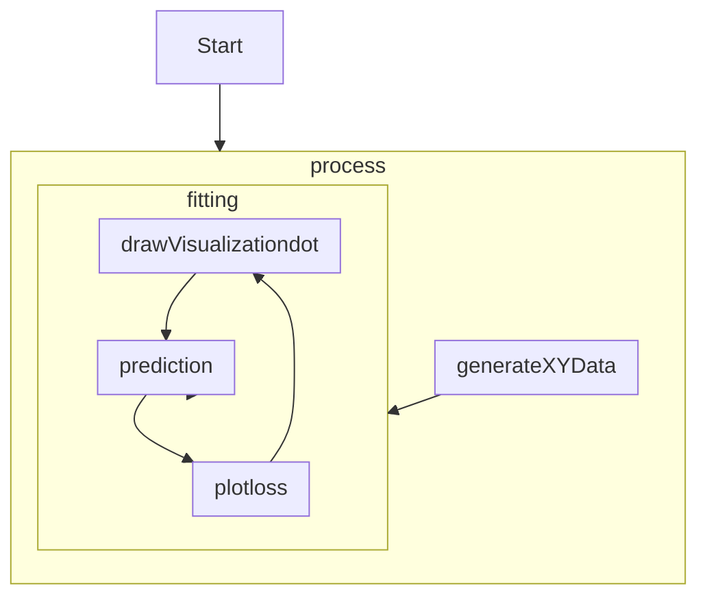

# ex11_1

## Structure

```
function drawVisualizationdot
function plotloss
function plotData2
function generateXYData
function fitting
function prediction
function process
```

## Flow



## Detail

1. process()
    1. generate initial linear regression coefficient.
    2. call generateXYData() to retreive training data sets.
    3. feed training data sets to fitting()
2. generateXYData()
