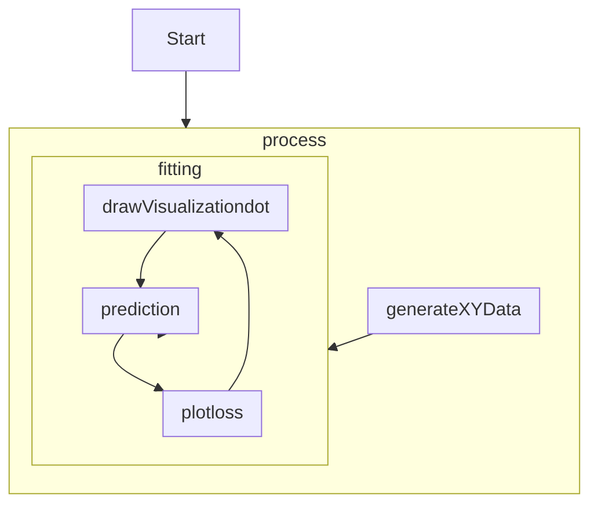

# ex11_1

## Structure

```
function drawVisualizationdot
function plotloss
function plotData2
function generateXYData
function fitting
function prediction
function process
```

## Flow



## Detail

1. process()
    1. generate initial linear regression coefficient.
    2. call generateXYData() to retreive training data sets.
    3. feed training datasets to fitting()
2. generateXYData()
    1. generate x data in the range between 0 and 1.
    2. generate y data based on corresponding x value and a random component.
    3. return two datasets: x, y.
3. fitting()
    1. set the method to construct neural network as sequential instead of functional. [src](https://stackoverflow.com/questions/57751417/what-is-meant-by-sequential-model-in-keras)
    2. add a dense layer
        1. tf.layers.dense.units: neuron count
        2. tf.layers.dense.inputShape: input node count
    3. set training optimizer as tf.SGDOptimizer which utilizes stochastic gradient descent(extreme large dataset).
    4. configure model settings for training.
    5. add bias node for input layer.
    6. convert datasets to tensor sets.
    7. start training.
        1. tf.keras.model.fit.batchSize: the number of samples to work through before updating the internal model parameters.
        2. tf.keras.model.fit.epochs:  the number times that the learning algorithm will work through the entire training dataset.
        3. tf.keras.model.fit.callbacks: access point of the model during training. In this case, it does the following stuff.
            1. tf.keras.callbacks.Callback.onEpochEnd: called at the end of Epoch, and perform the following stuff.
                1. print out epoch count and log.
                2. call Prediction().
                    1. prepare x data (input) for prediction (add bias node).
                    2. turn prepared x data into tensor.
                    3. tf.keras.model.predict: use input tensor to predict with current iteration of NN.
                    4. tf.Tensor.dataSync: retrieve data from tensor.
                    5. tf.keras.model.dispose: delete model.
                    6. tf.Tensor.dispose: delete predict result from memory.
                3. call plotData2().
                    1. restructure input array.
                    2. create vegaEmbed data structure containing restructured array as data and plot it on webpage.
                4. call plotloss().
                    1. restructure input array.
                    2. create vegaEmbed data structure containing restructured array as data and plot it on webpage.
                5. extract NN node current weight and log.
                6. append newly retrieve data.
                7. call drawVisualizationdot()
                    1. create vis.Graph3d data structure.
                    2. draw graph.
            2. jump back to 1, and loop until the training is finished.
