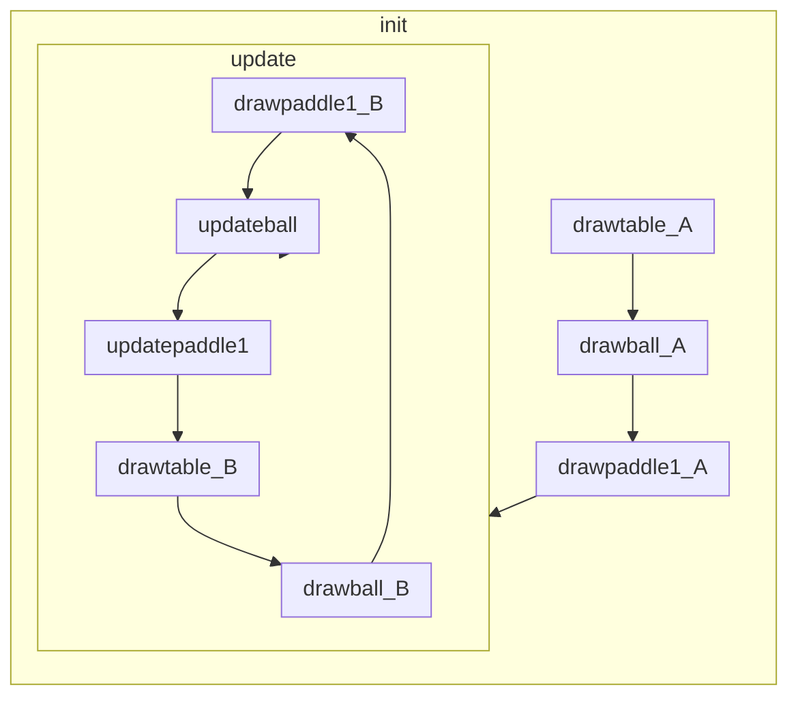

# ex11_2

## Structure

```
function drawtable
function drawball
function drawpaddle1
function init
function updateball
function update
function updatepaddle1
```

## Flow



## Detail

1. call init()
    1. call drawtable()
        1. draw the table background.
        2. define  the table border.
    2. call drawball()
        1. context.beginPath: initialize current subpath (drawing).
        2. context.arc: draw a circular object.
        3. fill the defined circle, which is the ball.
    3. call drawpaddle1()
        1. define a rectangle shaped object as the ball-reflecting paddle.
        2. fill the defined shape
    4. loop update() with a designated interval as 60 times per second.
        1. call updateball()
            1. define the top, bottom, left, right coordinate of the ball based on its center coordinate.
            2. if the ball (most left/right) is somehow outside of the defined left/right wall, invert its moving direction along the x axis. (simulate bouncing)
            3. if the ball (most top/bottom) is somehow outside of the defined upper wall/paddle, invert its moving direction along the y axis. (simulate bouncing)
            4. if the ball (center) is below the defined table (failed to reflect the ball by defined paddle), reset the ball coordinate. if not, update the moving speed of the ball.
        2. call udpatepaddle1()
            1. if left arrow key is pressed, move paddle left.
            2. if right arrow key is pressed, move paddle right.
            3. if not left or right arrow key is pressed, stop paddle from moving.
            4. if paddle moves outside of the left/right wall, limit their movement.
        3. call drawtable()
            1. Re-draw the table.
        4. call drawball()
            1. Re-draw the ball.
        5. call drawpaddle1()
            1. Re-draw the paddle.
2. record any key pressed movement.
    1. store the key in array.
    2. print out what key is pressed currently.
3. record any key lifted movement.
    1. remove the key in the key storage array.
