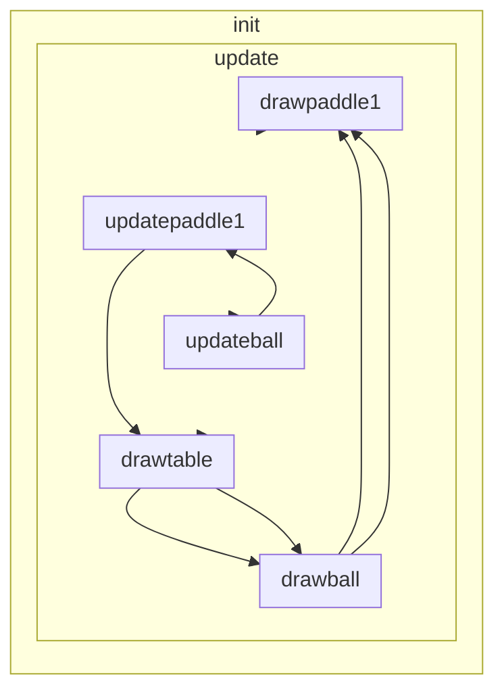

# ex11_2

## Structure

```
function drawtable
function drawball
function drawpaddle1
function init
function updateball
function update
function updatepaddle1
```

## Flow


```mermaid
flowchart TD

subgraph init
direction TB
    subgraph drawtable
    direction TB
    end
    subgraph drawball
    direction TB
    end
    subgraph drawpaddle1
    direction TB
    end
    subgraph update
    direction TB
        subgraph updateball
        direction TB
        end
        subgraph updatepaddle1
        direction TB
        end
        subgraph drawtable
        direction TB
        end
        subgraph drawball
        direction TB
        end
        subgraph drawpaddle1
        direction TB
        end
    end
end

init --> drawtable
drawtable --> drawball
drawball --> drawpaddle1
drawpaddle1 --> update
update --> updateball
updateball --> updatepaddle1
updatepaddle1 --> drawtable
drawtable --> drawball
drawball --> drawpaddle1
```

## Detail
