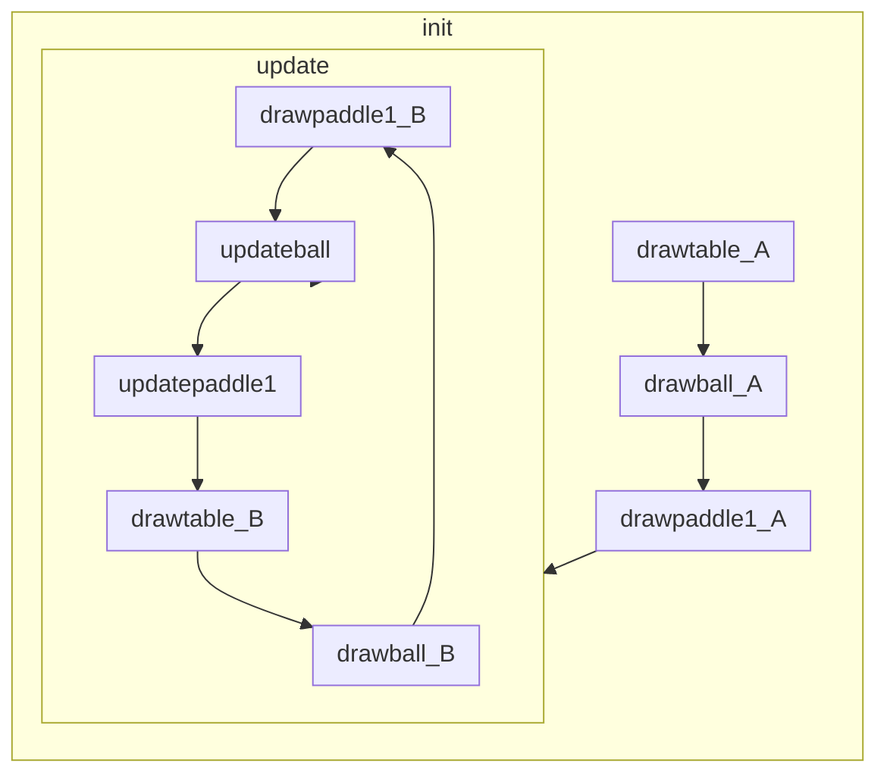

# ex11_4

## Structure

```
function drawtable
function drawball
function drawpaddle1
function init
function updateball
function update
function updatepaddle1
```

## Flow



## Detail

1. call init()
    1. call drawtable()
        1. draw the table background.
        2. define the table border.
    2. call drawball()
        1. context.beginPath: initialize current subpath (drawing).
        2. context.arc: draw a circular object.
        3. fill the defined circle, which is the ball.
    3. call drawpaddle1()
        1. define a rectangle-shaped object as the ball-reflecting paddle.
        2. fill the defined shape
    4. loop update() with a designated interval 30 times per second.
        1. call updateball()
            1. define the top, bottom, left, right coordinate of the ball based on its center coordinate.
            2. if the ball (most left/right) is somehow outside of the defined left/right wall, invert its moving direction along the x-axis. (simulate bouncing)
            3. if the ball (most top/bottom) is somehow outside of the defined upper wall/paddle, invert its moving direction along the y-axis. (simulate bouncing)
                1. if it's hitting the top wall, discard the player decision data.
                2. if it's hitting the paddle, increase player strike time.
            4. if the ball (center) is below the defined table (failed to reflect the ball by defined paddle), reset the ball coordinate, discard the player decision data. if not, update the moving speed of the ball.
            5. store paddle and ball coordinate.
            6. store player decision as either 0(left), 1(none), 2(right).
            7. store combine current and previous paddle and ball coordinate in array.
            8. action when player hit the ball with paddle.
                1. if it's the first time, clear all the previous data in memory.
                2. if it's not the first time, store all the previously stored data (5,6,7) in massive data array.
                3. if the number of data stored in massive data array exceed designated amount (10 in this case), create x (input: ball_x, ball_y, paddle_x, old_ball_x, old_ball_y, old_paddle_x) and y (output: left, none, right) data.
                4. convert the x and y array into JSON format.
                5. pop the download window and let user select local directory to store the JSON file.
            9. if the data is flagged to be cleaned, clean it.
        2. call udpatepaddle1()
            1. if left arrow key is pressed, move paddle left.
            2. if right arrow key is pressed, move paddle right.
            3. if not left or right arrow key is pressed, stop paddle from moving.
            4. if paddle moves outside of the left/right wall, limit their movement.
        3. call drawtable()
            1. Re-draw the table.
        4. call drawball()
            1. Re-draw the ball.
        5. call drawpaddle1()
            1. Re-draw the paddle.
2. record any key-pressed movement.
    1. store the key in array.
    2. print out what key is pressed currently.
3. record any key-lifted movement.
    1. remove the key in the key storage array.

## Difference with ex11_3.html

1. change the storing player data amount from 10 to 3000. This can likely help NN model to converge to appropriate result.
