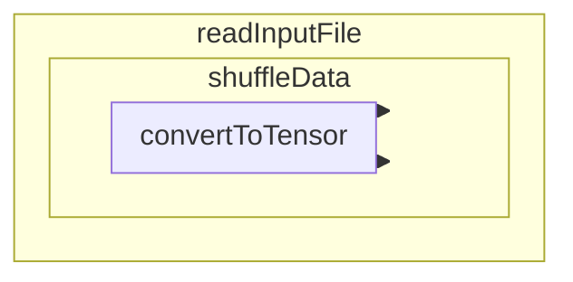

# ex11_2

## Structure

```
readInputFile
shuffleData
convertToTensor
```

## Flow


```mermaid
flowchart TD

subgraph readInputFile
    subgraph shuffleData
        subgraph convertToTensor
        end
    end
end

readInputFile --> shuffleData
shuffleData --> convertToTensor
```

## Detail

1.
