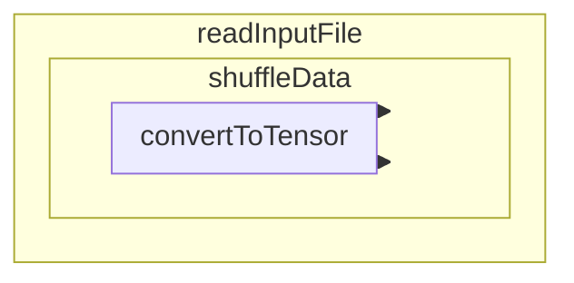

# ex11_2

## Structure

```
readInputFile
shuffleData
convertToTensor
```

## Flow



## Detail

1. Call readInputFile() if the user clicked "browse" to upload the model stored by both "ex11_3.html" and "ex11_4.html".
    1. From the uploaded model file, read the content from it.
    2. Turn the content into a JSON object.
    3. Call shuffleData()
        1. Separate different subobjects into x and y and recombine them.
        2. tf.util.shuffle: shuffle the x and y datas.
        3. Call convertToTensor()
            1. Separate x and y sets.
            2. Get length of the sets.
            3. Turn x and y sets into separate 2D tensor arrays.
            4. Create a model in the shape of 6*64*64*3 (without bias, include input and output).
            5. Set model optimizer as "adam" and set learning rate, loss, and output number during training.
            6. Print out the structure of the created model.
