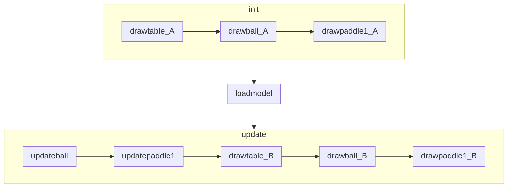

# ex11_2

## Structure

```
function drawtable
function drawball
function drawpaddle1
function init
function loadmodel
function updateball
function updatepaddle1
function update
```

## Flow



## Detail

1. call init()
    1. call drawtable(), to draw the pong table.
    2. call drawball(), to draw the pong.
    3. call drawpaddle1(), to draw the ball-reflecting paddle.
2. call loadmodel()
    1. load trained model from webpage memory storage.
    2. print out the structure of model.
    3. call update() 60 times per second.
        1. call updateball()
            1. determine whether the ball hit both sides of the table.
                1. if hitting the right wall, turn x direction left.
                2. if hitting the left wall, turn x direction right.
            2. determine whether the ball hit the upper wall or the paddle.
                1. if hitting the upper wall, turn y direction down.
                2. if hitting the paddle, turn y direction up.
            3. determine whether the ball exceed the bottom of the table.
                1. if exceed, reset ball position.
                2. if not exceed, update ball location.
        2. call updatepaddle1()
            1. store current data: paddle_x_pos, ball_x_pos, ball_y_pos.
            2. combine current data and previous data.
            3. turn these combined data into tensors.
            4. send the tensors to loaded model and predict with it.
            5. extract the prediction and user the result to move the paddle.
            6. determine whether the paddle positionn exceed left and right walls. if exceed, limit it's position between the two walls.
            7. delete tensors and prediction resulst.
        3. call drawtable(), to draw the pong table.
        4. call drawball(), to draw the pong.
        5. call drawpaddle1(), to draw the ball-reflecting paddle.
