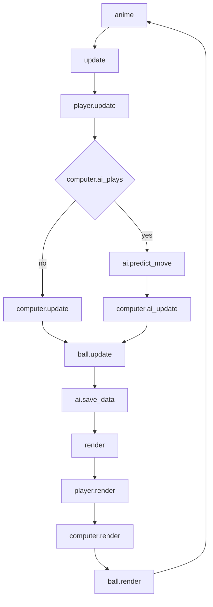

# ex11_7

## Structure

```
render
update
step
Paddle.render
Paddle.move
Computer.render
Computer.update
Player.render
Player.update
Ball.render
Ball.update
AI.save_data
AI.new_turn
AI.reset
AI.train
AI.predict_move
```

## Flow



## Detail (ex11_7_pong_game.js)

(this file is launched after loading all tensorflow functions)

1. Initialize NN model.
2. Add canvas to html document.
3. call step() to loop for 60 times per second by animate().
    1. call update().
        1. call player.update()/Player.prototype.update()
            1. if left arrow key is pressed, move player paddle left.
            2. if right arrow key is pressed, move player paddle right.
            3. if other keys is pressed, don't move player paddle.
        2. determine whether computer.ai_plays is true. (whether ai is running)
            1. if it's true
                1. perform prediction with the trained model.
                2. extract the decision of the model.
                3. move computer controlled paddle.
            2. if not
                1. calculate the x-axis distance between the ball and the computer controlled paddle.
                2. move the computer controlled paddle based on the calculated distance.
        3. call ball.update()
            1. update ball coordinate based on the speed of the ball.
            2. update ball border by the new ball coordinate.
            3. revert the ball x-axis moving direction if the outline of ball touches left and right walls.
            4. if the ball goes outside of the y-axis limit (top/bottom table)
                1. reset ball speed and coordinate.
                2. call ai.new_turn()
                    1. clear previous data.
                    2. update turn count.
                    3. if it's not the first turn
                        1. call ai.train()
                            1. if no new data is store, return this function
                            2. turn all the newly gathered data into tensors. (both x, y)
                            3. train the model with the updated tensors.
                        2. call ai.reset()
                            1. reset all parameters.
            5. determine which section the ball is resting
                1. in player's section
                    1. if the ball hit player's paddle, invert the ball's y direction.
                2. in computer's section
                    1. if the ball hit computer's paddle, inver the ball's y direction.
        4. call ai.save_data()
            1. if the NN model is not initialized yet, return this function.
            2. if no previous data is stored, store and return.
            3. based on whether the ball traveled to different side of the table
                1. if yes, keep reverted x(input) data
                2. if no, keep x(input) data
            4. store the data to memory for future training.
    2. call render()
        1. draw the table.
        2. call player.render()
            1. draw player's paddle.
        3. call computer.render()
            1. draw computer's paddle.
        4. call ball.render()
            1. draw the ball.
