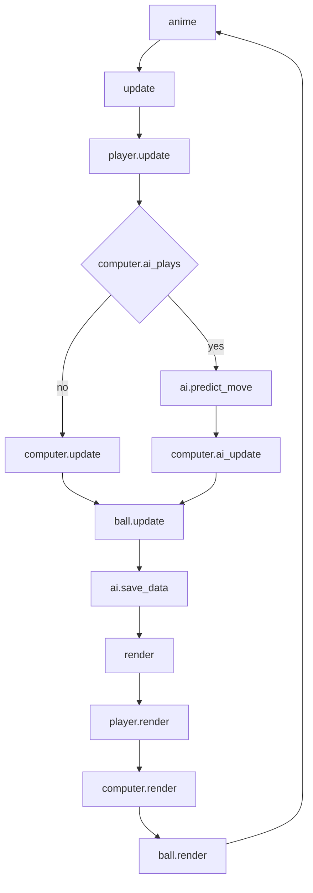

# ex11_2

## Structure

```
render
update
step
Paddle.render
Paddle.move
Computer.render
Computer.update
Player.render
Player.update
Ball.render
Ball.update
AI.save_data
AI.new_turn
AI.reset
AI.train
AI.predict_move
```

## Flow



## Detail

1.
